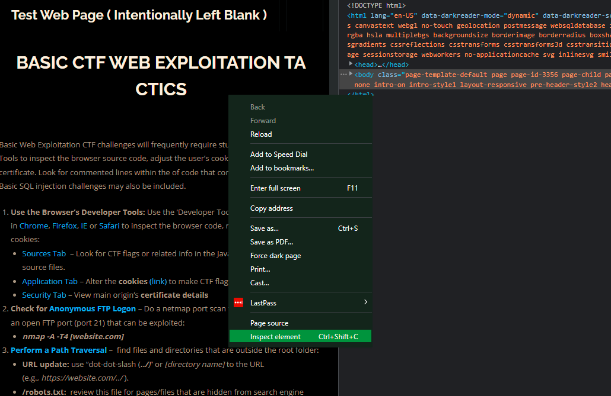

<h1 align="center">Web Exploitation 100</h1>
  <p align="center">
     Basic Web Exploiation
  </p>

### Table of contents

- [Introduction](#introduction)
- [Source Code](#source-code)
- [SQL injection](#sql-injection)
- [Dir Fuzzing](#)

## Introduction: 
This Course will Walk you througth Getting the basic skills about how to exploit common Web vulnerabilties, This includes SQL injection,Source code reading, finding hidden directories,local file inclusion, directory traversal.

## Source code: 
We already know a websites consists of 3 parts of code , HTML code which is a squeleton to the global makeup of the site , CSS code which styles the website , and lastely Javascript to make the site more dynamic (handling events, ads banners, redirection, submitting forms).
Getting to read these code maight reveals sensitive information , or give more information about the target, so reading the Source Code (HTML , JS , CSS) is essential in any try to find any vulnerabilities , The way to read the website Source code is to right click and `inspect` or using key shortcut  `CTRL-U`.

Here is how : 
<center></center>

## SQL injection: 


All of websites stores there data (which are usually large) in a format called a database, to communicate with this database we need a specific language called [SQL](https://learnxinyminutes.com/docs/sql/), lets suppose a website use PHP as its backend programming language , and when you have to login useing a username and a  `password` : 

```php
<?php

$query  = "SELECT id FROM users
           WHERE username='$username' and password = '$password'";
$result = odbc_exec($conn, $query);

?>
```

Suppose we put the character `'` in the $password variable , Error right !!,we can do more , we want to login as an admin, lets suppose the admin username is `admin`, we don't have the password , we need a way to login without a password, in SQL comments start with `-- ` and space at the end, we can try to input `';-- `this will end the query and comment what is left

`SELECT id FROM users WHERE username='admin' and password = '';--';` This will make the password equal to '' , we still need a way to make The verification `username='$username' and password = '$password'` true , its an and operator , we can try to make an or with 1=1 which will bring `password = '$password' or 1=1` true , then and with true gives us true, the final payload is `' or 1=1;-- ` the `'` to escape the string , `or 1=1` to make the validation true , and `;-- ` to make the query syntaxically correct.
